# Spring Boot CRUD REST API – Task 1 & Task 2

## Project Overview

This repository contains two Java applications created using the **Spring Framework** as part of a university assignment.  
The purpose of the project is to demonstrate understanding of Spring Boot fundamentals, REST API design, HTTP methods, database integration, and API testing.

The project consists of:

- **Task 1** – a basic Spring Boot application with a simple controller  
- **Task 2** – a fully functional CRUD REST API using Spring Boot and H2 database  

Both applications are fully functional, tested, and ready to be demonstrated.

---

## Technologies Used

- Java  
- Spring Boot  
- Spring Web  
- Spring Data JPA  
- H2 Database (in-memory)  
- Spring Boot DevTools  
- Maven  
- Swagger / OpenAPI  
- Postman  
- IntelliJ IDEA  

---

## Project Structure

├── task1/
│ └── Basic Spring Boot application
│
├── task2/
│ └── CRUD REST API application
│
└── README.md


Each application follows standard Spring Boot project structure and good development practices.

---

## Task 1 – Basic Spring Boot Application

### Description

Task 1 focuses on creating a simple Spring Boot application from scratch.  
The goal of this task was to understand how Spring handles HTTP requests and how controllers work.

The application includes:
- A basic Spring Boot configuration
- A controller handling HTTP GET requests
- Returning responses directly to the browser
- Basic MVC concepts

### Example Endpoint

GET http://localhost:8081/


### Result

The application returns a simple response in the browser confirming that the Spring Boot application is running correctly.

---

### Screenshots – Task 1


- Application running in IntelliJ
- Browser response on localhost

---

## Task 2 – CRUD REST API Application

### Description

Task 2 is a backend-only REST API application built with Spring Boot.  
The application allows performing full CRUD operations on resources using HTTP methods.

There is no frontend — the API is tested using **Postman** and **Swagger UI**.

---

## Architecture Overview

The application follows a layered architecture:

- **Controller layer** – handles HTTP requests and responses  
- **Service layer** – contains business logic  
- **Repository layer** – handles database operations  
- **Domain layer** – represents database entities  
- **Support layer** – object mapping and exception handling  

---

## Package Structure (Task 2)

product
├── api
│ └── ProductController
│
├── domain
│ └── Product
│
├── service
│ └── ProductService
│
├── repository
│ └── ProductRepository
│
├── support
│ ├── ProductMapper
│ └── exception
│
└── shared.api.response
└── ErrorMessageResponse


---

## Database

The application uses an **H2 in-memory database**.

- Data exists only while the application is running
- Managed automatically by Spring Data JPA and Hibernate

### H2 Console

http://localhost:8081/console


**JDBC URL:** jdbc:h2:mem:testdb

---

## REST API Endpoints

### Get All Products

GET /api/v1/products
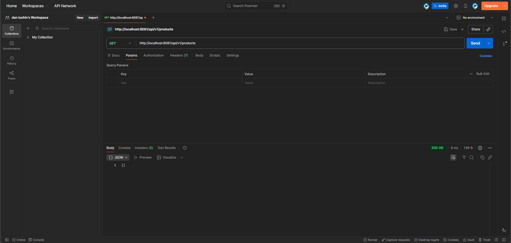

The H2 Database is empty
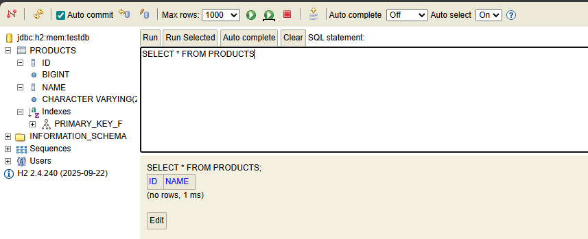

### Create Product

POST /api/v1/products

**Request Body (JSON):**
```json
{
  "name": "First product"
}
```

Response:

* HTTP Status: 201 Created

* Returns the created product with generated ID

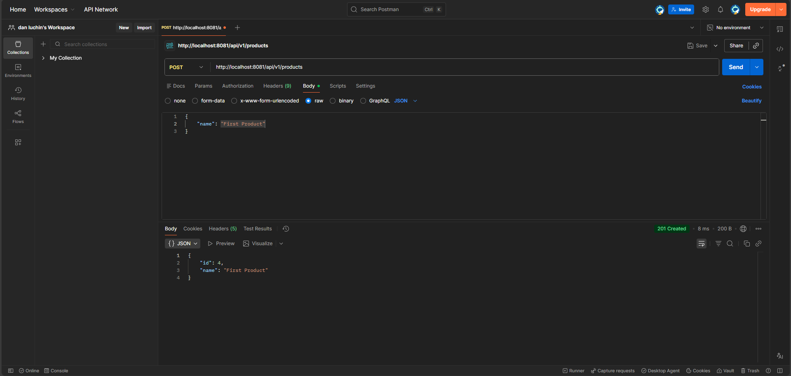

**The Database has one product**
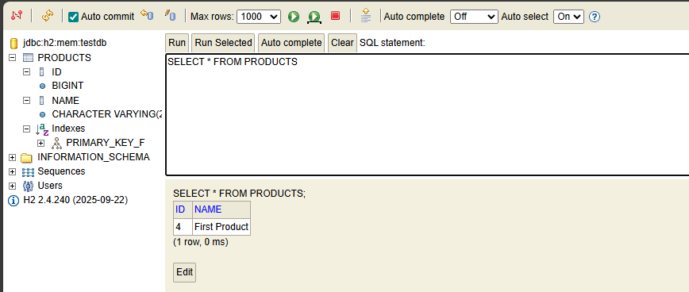

### Create another product

POST /api/v1/products

**Request Body (JSON):**
```json
{
  "name": "Second product"
}
```

Response:

* HTTP Status: 201 Created

* Returns the created product with generated ID


The Database has two products
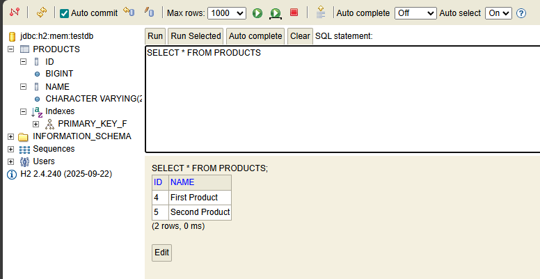

### Get All Products

GET /api/v1/products
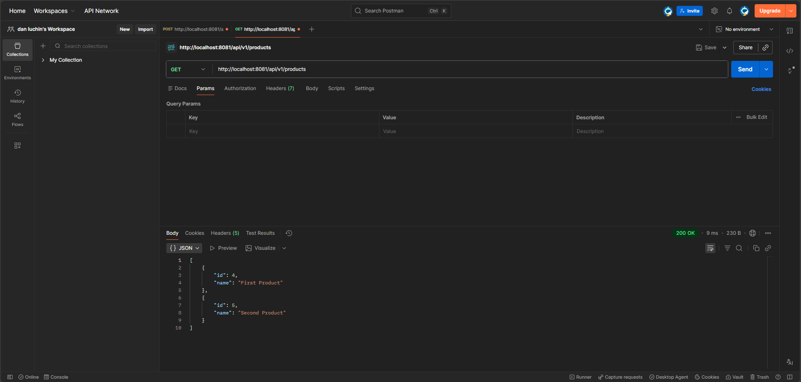

### Update product

PUT /api/v1/products/{id}

**Request Body (JSON):**

```json
{
  "name": "2 Product after update"
}
```

Response:

* HTTP Status: 200 OK

* Returns product state after update

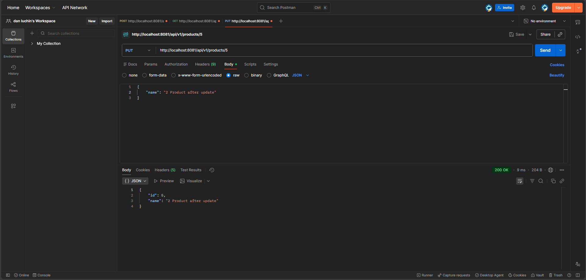

**The updated Database**
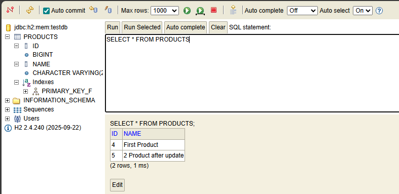

### Get All Products

GET /api/v1/products
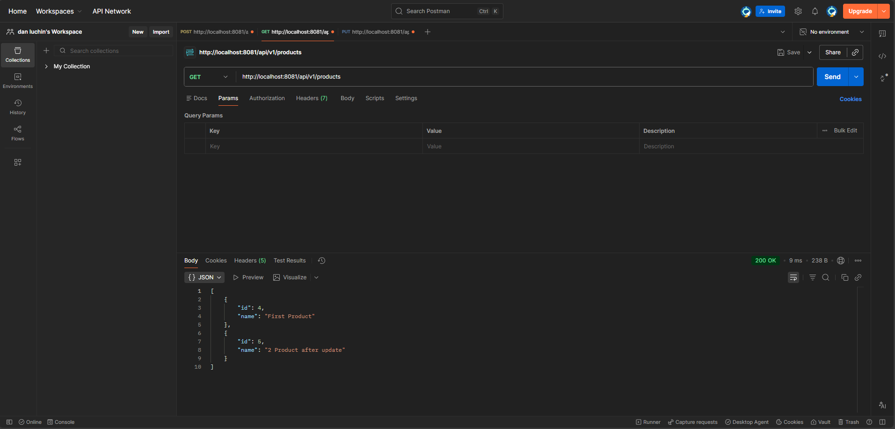

### Delete Product

DELETE /api/v1/products/{id}

Response:

* HTTP Status: 204 No Content – deletion successful

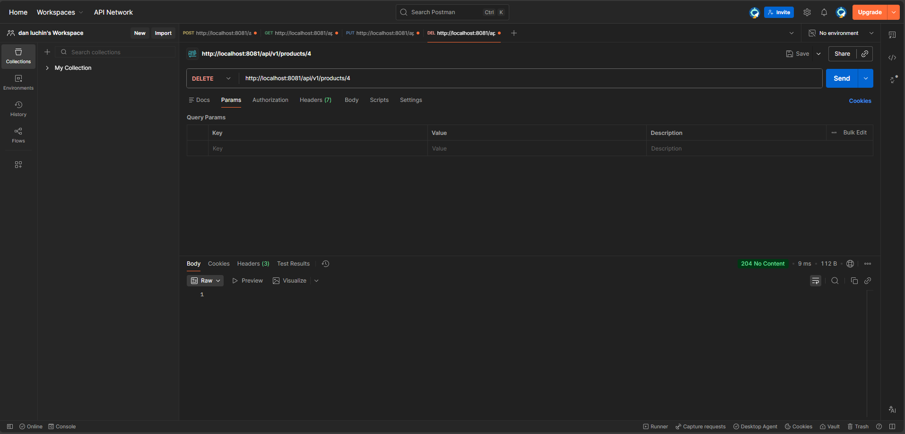

**The Database after deletion**
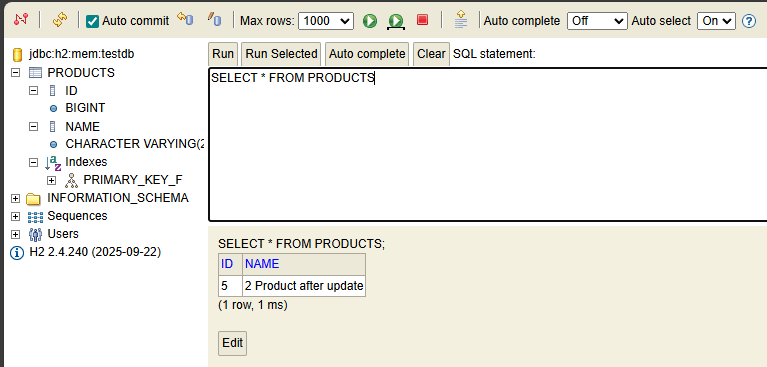

### Get All Products

GET /api/v1/products


## Exception Handling

**The application includes custom exception handling:**

* ProductNotFoundException

* Centralized exception handling using @ControllerAdvice

* Meaningful error messages returned to the client

* Proper HTTP status codes instead of generic server errors

### Update a non-existing product

PUT /api/v1/products/{non-existing id}

**Request Body (JSON):**

```json
{
  "name": "2 Product after update"
}
```

Response:

* HTTP Status: 404 Not Found - product was not found

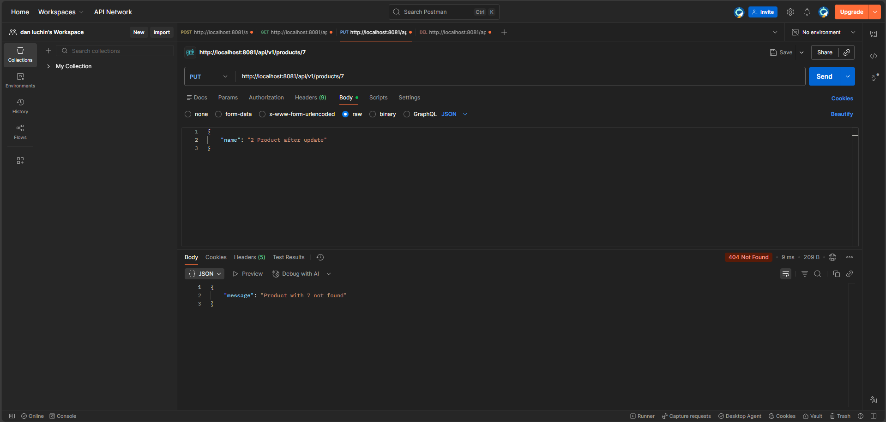

### Delete a non-existing product

DELETE /api/v1/products/{non-existing id}

Response:

* HTTP Status: 404 Not Found - product was not found

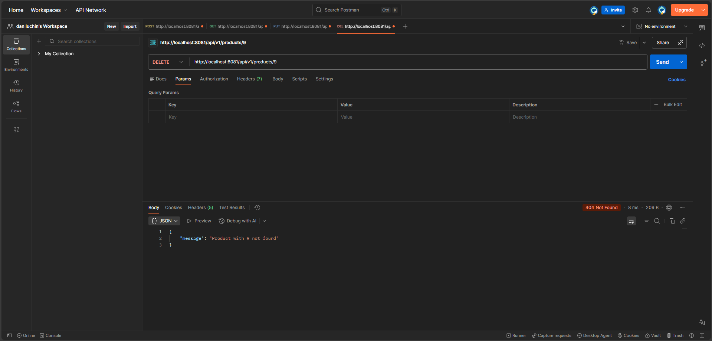

* Swagger / OpenAPI Documentation

* Swagger UI is included to visualize and test the API.

**Swagger UI**
http://localhost:8081/swagger-ui/index.html

**OpenAPI JSON**
http://localhost:8081/v3/api-docs


Swagger allows testing endpoints directly from the browser and provides automatic API documentation.

**Testing**

The application was tested using:

* Postman

* Swagger UI

* H2 Database Console

**All CRUD operations were tested, including error scenarios (non-existing resources).**

.gitignore files are included

Unnecessary and generated files are excluded from version control

**Conclusion**

This project demonstrates:

* Understanding of Spring Boot fundamentals

* REST API design using HTTP methods

* Layered architecture and clean code structure

* Database integration using Spring Data JPA

* API testing and documentation using Postman and Swagger